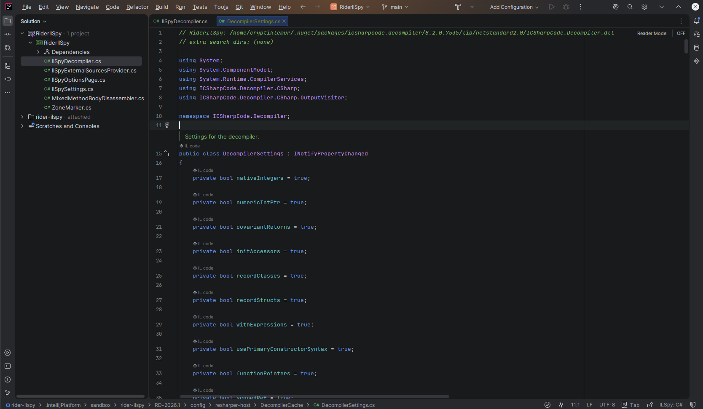

# Rider-ILSpy

Replaces Rider's built-in decompiler with [ILSpy](https://github.com/icsharpcode/ILSpy) for assembly browsing, goto-definition into external sources, and debug-data driven navigation.



## Features

- ILSpy-quality C# output for any compiled type you navigate into
- Status-bar widget to switch decompiler output between **C#**, **IL**, and **C# + IL**
- Mode changes refresh open decompiled editors in place (no close/reopen)
- Mixed mode interleaves IL with the matching C# source lines as comments at the correct offsets — same as the Windows ILSpy GUI
- Settings page (Preferences → Tools → ILSpy Decompiler) for fine-grained decompiler flags and extra assembly search dirs

## Requirements

- Rider **2026.1** or newer
- .NET SDK 8 (only needed if building from source; the released plugin ships its own assemblies)

## Install

Once published: search for **Rider-ILSpy** in `Settings → Plugins → Marketplace`.

To install a local build:

```sh
./gradlew buildPlugin
# then in Rider: Settings → Plugins → ⚙ → Install Plugin from Disk…
# pick build/distributions/Rider-ILSpy-<version>.zip
```

## Usage

1. Navigate into any compiled type (Ctrl+B / Go to Declaration on a symbol from a NuGet ref, framework type, etc.) — the decompiled source comes from ILSpy.
2. Click the **ILSpy: ...** widget in the status bar to switch modes. Currently-open ILSpy editors update in place.
3. Tweak decompiler behavior under `Settings → Tools → ILSpy Decompiler` (async/await, named arguments, expression bodies, etc.).

## Build from source

```sh
git clone https://github.com/cryptiklemur/rider-ilspy
cd rider-ilspy
./gradlew buildPlugin
```

To run the plugin in a sandboxed Rider for development:

```sh
./gradlew runIde
```

## How it works

The plugin has three pieces, talking over the JetBrains rd protocol:

- **Kotlin frontend** (`src/main/kotlin/...`) — status-bar widget, persistent settings, options page. `IlSpyProtocolHost` pushes the selected mode onto `RiderIlSpyModel.mode` whenever the user toggles it, and advises on `RiderIlSpyModel.readyTick` to refresh open ILSpy editors.
- **C# ReSharper backend** (`ReSharperPlugin/RiderIlSpy/...`) — registers an `IExternalSourcesProvider` so Rider's navigation pipeline routes through ILSpy. `IlSpyExternalSourcesProvider` advises on the rd `mode` property, redecompiles tracked types in place when it changes, and fires `readyTick` so the frontend knows when to refresh.
- **Shared protocol contract** (`protocol/`) — an rd-gen subproject that generates the `RiderIlSpyModel` extension on `SolutionModel.Solution`. Both runtimes consume the generated bindings, so the IPC surface lives in one place.

## License

MIT
